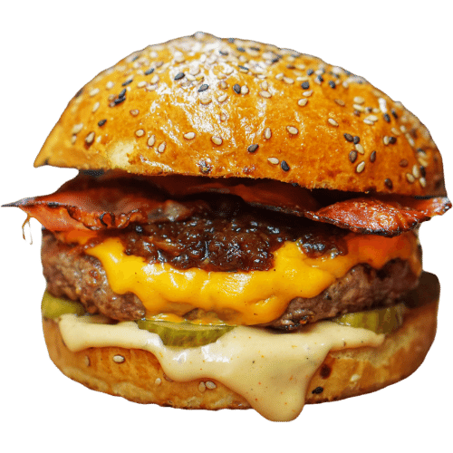

<h1>Coztic Burguers - Hamburger Restaurant Website Template</h1>

    

Welcome to the Coztic Burguers template! This is a modern and vibrant burger restaurant website designed with Bootstrap 5 and vanilla JS. It is perfect for those who want to showcase the menu, promotions and unique atmosphere of their burger restaurant.

<h2>Key features</h2>
<ul>
<li>Modern and attractive design</li>
<li>Fully responsive and compatible with mobile devices</li>
<li>Bootstrap 5 integration</li>
<li>Animations and interactive effects with vanilla JS</li>
<li>Featured sections to show the menu, promotions and location of the restaurant</li>
<li>Image gallery to showcase the most delicious burgers</li>
<li>Contact form for reservations or inquiries</li>
</ul>

<h2>Requirements</h2>
Basic knowledge of HTML, CSS and JavaScript
Bootstrap 5 (included in the template)

<h2>Usage</h2>
<ul>
<li>Clone or download the repository.</li>
<li>Open the HTML files in your favorite code editor.</li>
<li>Customize the content, colors and styles according to your needs.</li>
<li>Add your own images or use the ones we offer in the gallery folder.</li>
<li>If you want to change the behavior or add more functionality, modify the corresponding JavaScript file.</li>
<li>If you find any bugs or have suggestions for improvements to this template, feel free to open an issue or send a pull request to the repository.</li>
</ul>

I hope this template is useful and helps you to share your talent as a web developer with the community! If you have any questions or need additional help, don't hesitate to let me know.

